<div align="center">

# NeoFold Edge

**A private, on-premise AI workstation that turns a tumour genome into a small, ranked, explained shortlist of neoantigen research candidates.**

Runs entirely on one HP ZGX Nano (NVIDIA GB10 Grace Blackwell). No cloud inference, no external APIs, no patient data leaving the building.


</div>

---

## Why we built this: a dog named Rosie

In 2024 a five-year-old rescue dog in Australia was diagnosed with an aggressive mast cell tumour. Chemotherapy slowed it but could not shrink it. The tumour on her leg grew to the size of a tennis ball.

Her owner, **Paul Conyngham**, is a data analyst with seventeen years in machine learning and **no background in biology whatsoever**. Rather than accept the prognosis, he paid several thousand dollars out of his own pocket to have Rosie's tumour and healthy DNA sequenced at the University of New South Wales. Then he used **ChatGPT** to work out which mutations mattered and **AlphaFold** to predict the shapes of the resulting proteins — and, with computational biologists at the UNSW Ramaciotti Centre and chemists at the UNSW RNA Institute, designed a **personalised mRNA cancer vaccine** for one specific dog.

Rosie received her first injection in December 2025. By mid-March her largest tumour had shrunk by roughly 75%. She went from barely walking to jumping a fence.

**Read that again, because the remarkable part is not the biology.** A man with no wet-lab training reasoned his way from a genome file to a working therapeutic hypothesis, because the tools had finally become good enough for someone outside the field to use them. That is a genuinely new thing in the world.

### And here is exactly where it stops

Rosie's case works as a proof that the *idea* is sound. It does not scale, for four specific reasons — and this project is a direct attempt at the ones that are fixable.

| What Rosie's case needed | Why that does not generalise |
|---|---|
| A university genomics centre, an RNA institute and a veterinary school | Most people do not have UNSW on speed dial |
| Months of expert back-and-forth | *"What is holding us back is actually **the speed** by which we are generating these vaccines"* — the field's own diagnosis |
| Cloud AI tools for the analysis | Fine for a dog. For a **human patient**, sending a tumour genome to an external service is a regulated disclosure, not a file upload |
| A human in the loop to catch the model's mistakes | ChatGPT and AlphaFold will both answer confidently when they are wrong. Someone has to know which answers to distrust |

> ⚠️ **The honest caveat, stated up front**, because an oncologist made it publicly and we are not going to pretend otherwise: Rosie is *one dog*, not a controlled study, mast cell tumours behave unpredictably, and she received the vaccine **alongside an immune checkpoint inhibitor** — so nobody can cleanly attribute the response to the vaccine. We are not claiming Rosie was cured by AI. We are claiming the workflow she is an example of is real, is being attempted by people without institutional backing, and deserves better tooling than a chat window.

**NeoFold Edge is that tooling, for the analysis step, on a box that fits on a desk and never phones home.**

---

## What this actually does

It takes the file a sequencing lab gives you — a list of the mutations in a tumour — and produces a short, ranked, explained list of the peptide fragments most worth testing in a laboratory.

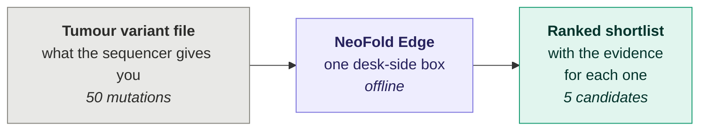

### The analogy that makes this concrete

Imagine a library of **1,890 identical-looking books**. Exactly **fifty-one** of them are worth reading. You may take five off the shelf, and reading one takes three weeks.

That is neoantigen prioritisation. Picking five at random gives you about a **2.7%** chance per pick. Our screen raises that to **16–32%** — **five to six times better than chance**, measured against 2,555 peptides that were actually tested on human T-cells in a laboratory.

Not certainty. **A five-fold better use of the most expensive resource in the building: laboratory time.**

---

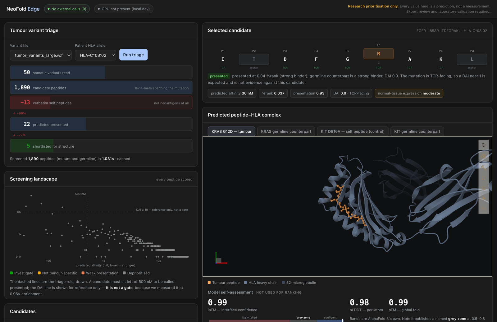

---

## Why this has to run on the edge — and why that is not a gimmick

Every edge-AI pitch claims latency. **Ours does not**, and you should be suspicious of any batch-processing project that does. Nobody needs a cancer shortlist in 50 milliseconds.

The real argument is **privacy, and the machinery that privacy drags behind it.**

### A tumour genome is not a file. It is an identity.

Your genome identifies you more precisely than your fingerprint, and unlike a password **you cannot change it**. It also partially identifies your parents, your siblings and your children — people who never consented to anything. Researchers have recovered surnames from anonymous genomic data using only public genealogy databases.

So the moment a tumour/normal sequencing file leaves a hospital, it stops being a computation and becomes a **regulated disclosure**:

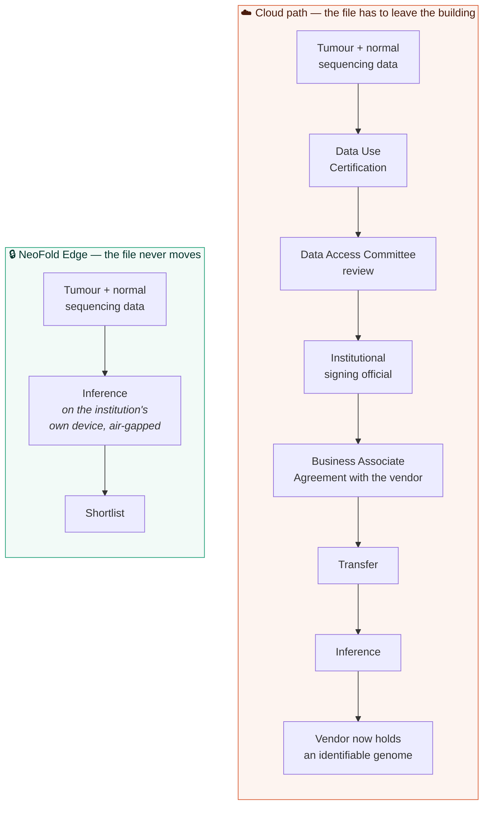

**Those boxes on the left are not paperwork. They are weeks.** And weeks are the thing the field says it does not have — for a patient with an aggressive tumour, the clock that matters runs from biopsy to treatment, and the peer-reviewed benchmark for a personalised vaccine is a **median of 9.4 weeks from surgery to first dose**. Every approval step competes with the patient's disease.

Running locally does not *satisfy* that governance process faster. **It deletes the step entirely**, because there is no disclosure to approve.

### Two corrections we make before a judge makes them for us

Most edge-versus-cloud arguments in this space are wrong in the same two ways. We do not make either.

**❌ "Cloud egress is too expensive."** It is not. A whole-exome tumour/normal pair is about 60 GB — roughly **$5** to move, and the first 100 GB a month is free. Anyone with an AWS bill would laugh at that slide.

**❌ "DNA is one of HIPAA's 18 identifiers."** It is not, and this is checkable in the regulation in thirty seconds. 45 CFR 164.514(b)(2)(i) lists (A) through (R); item (P) is *"biometric identifiers, including finger and voice prints."* DNA does not appear.

**✅ The correct argument is subtler and much stronger.** Genetic information **is** protected health information when it is identifiable — but because DNA is *not* on the Safe Harbor list, **you cannot de-identify a genome by deleting eighteen fields.** There is no checkbox that makes it safe to send. You fall back on the "no actual knowledge it could identify anyone" clause, which the re-identification literature makes very hard to claim honestly about a genome.

**A cloud provider cannot solve this for you. A local box makes the question not arise.**

### Why a Nano specifically, and not a gaming GPU

| | |
|---|---|
| **128 GB unified memory** | The structure model, the reference proteome and the candidate set all sit in memory together. On a 24 GB consumer card you work through a letterbox, swapping pieces in and out. Here you lay the whole engine out on the bench at once. |
| **38 W peak** | Measured, under full load — roughly what a laptop draws. It runs off a wall socket in a cupboard: no rack, no data-centre power, no cooling plant. |
| **Physically one box** | A hospital can put it in a locked room. You cannot put a cloud region in a locked room. |
| **Fully offline** | We proved it: the entire pipeline was rehearsed with **every outbound connection blocked**. The dashboard shows a live external-connection counter, and it reads zero. |

The deployment story this unlocks is the point: **a district hospital, a university lab, or a veterinary oncology clinic can own this outright.** No procurement cycle, no vendor contract, no data-sharing agreement, no recurring bill that ends the project when the grant does. That is what decentralises a capability — not making it faster, but making it *ownable*.

---

## The biology, in plain terms

A tumour cell is one of your own cells with a corrupted instruction manual. Most corruptions are invisible. A few produce a protein fragment your immune system could, in principle, recognise as wrong.

Five gates have to open, in order:

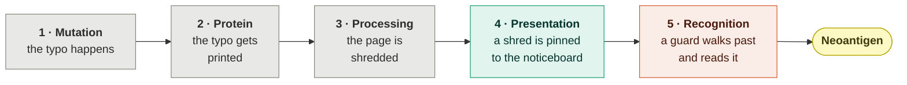

Every cell in your body runs a **noticeboard** — an HLA molecule — displaying shredded fragments of whatever it is currently making. Immune cells patrol past and read them. A fragment that looks foreign gets the cell destroyed. That is how your body finds virus-infected cells, and it is how it could find cancer.

**Gate 4 — does the fragment get pinned to the noticeboard?** — is what computational tools are genuinely good at. Twenty-five years of laboratory binding measurements have trained the predictors well. Our screen scores **AUC 0.777** here.

**Gate 5 — does a guard exist who can read that particular notice?** — is where everything falls apart. Whether the right immune cell exists in *this specific person's* repertoire, and was not deleted during development for looking too much like self, is not in any training data. Nobody can measure a person's full repertoire.

That gap is the whole difficulty of the field:

| Study | Candidates tested in the lab | Actually worked | Rate |
|---|---|---|---|
| **TESLA** — Wells *et al.*, *Cell* 2020 | 608, top-ranked by **25 independent expert pipelines** | **37** | **6.1%** |
| **Bjerregaard** *et al.* 2017 — 13 pooled studies | 1,947 neopeptide–HLA pairs | **53** | **2.7%** |

Those 608 were not a random sample. They were the *best* candidates that twenty-five research groups — including the people who built the standard predictors — could nominate. **Six percent worked.**

So "find the neoantigen" is not a promise any tool can keep. **"Concentrate the real ones into a list short enough to test"** is, and it is measurable.

---

## What the pipeline does with that

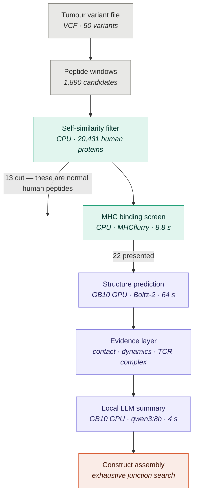

**Teal = local CPU. Purple = GB10 GPU. Grey = data. Coral = output.** Nothing leaves the box.

The ordering is deliberate: the cheap test runs first. Screening one peptide costs **2.3 milliseconds** on a CPU; folding one costs **64 seconds** on the GPU. That is a factor of roughly **28,000**, so the expensive stage only ever sees candidates that survived the cheap one.

One run, end to end, with measured timings:

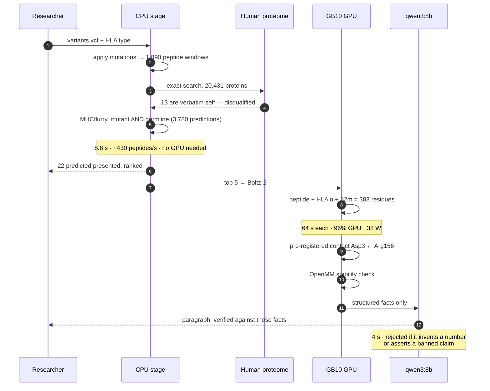

---

## What you are looking at, and why it matters

### 1 · The funnel — 1,890 down to 22

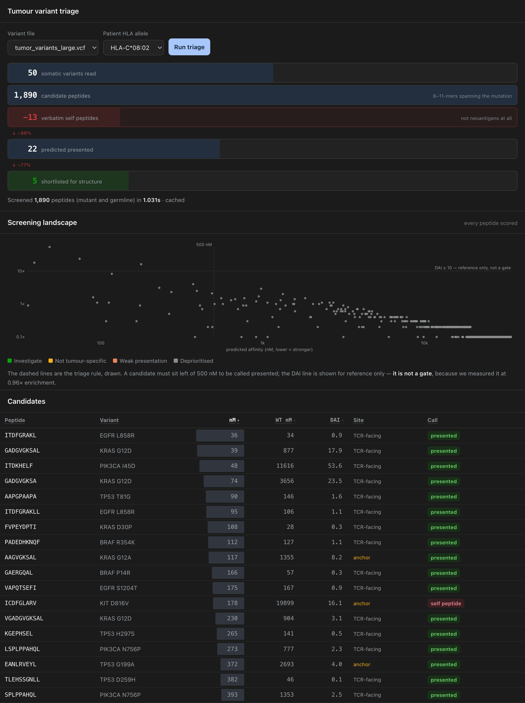

**The analogy:** this is airport security for peptides. Everyone goes through the metal detector (cheap, fast, catches most things). Only a handful get the full search.

Three things on this screen are worth a judge's attention:

**The grey cloud is the point.** Every dot in the scatter is a peptide the screen considered. The shortlist is the tiny cluster at the left edge. Most tools show you the winners; showing the crowd is what makes "we concentrated it five-fold" a claim you can actually see.

**The red row is a mutation that does not count.** `ICDFGLARV` comes from **KIT D816V**, a genuine, recurrent cancer driver. It has the single largest mutant-versus-normal signal in the whole demo — **112×**. By every conventional metric it is the best candidate on the board.

It is also a **verbatim match to a normal human protein**, ERK2. The `DFG` motif it contains is conserved across essentially every protein kinase you have. An immune response against it would attack healthy tissue throughout the body.
> **The analogy:** you are looking for a suspect with a distinctive tattoo, and you find one — but the tattoo turns out to be a wedding ring. It is not distinctive. It is on everyone. **Our filter catches it; the conventional metrics all rank it first.**

**The bars behind the affinity numbers** are a log scale. Binding strength spans four orders of magnitude in that column, and a column of bare digits hides that completely.

### 2 · The structure — why *this* mutation works

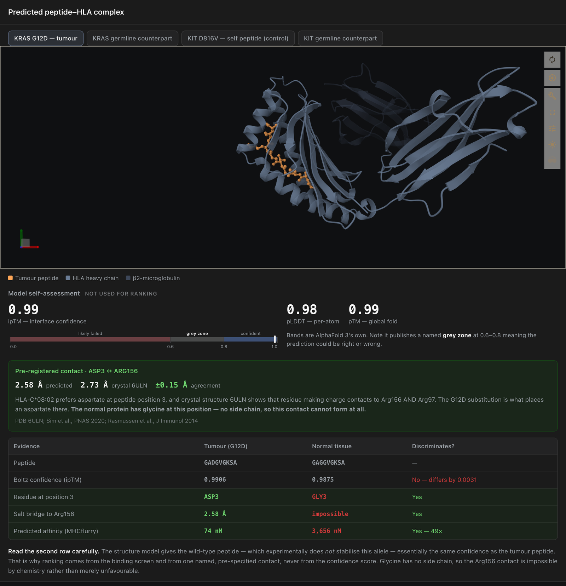

The peptide sits in the HLA groove **like a hot dog in a bun**. Some of its side chains point *down into the bun* — these are the **anchors**, and they control how well it sits. Others point *up*, and those are the only ones an immune cell ever sees.

**This distinction is why one of our own filters failed** (more below), and it is the single most misunderstood thing in neoantigen prediction.

For KRAS G12D, the mutation replaces a **glycine** with an **aspartate** at position 3. HLA-C\*08:02 has a positively-charged pocket right there. The crystal structure shows the aspartate forming a **2.7 Å salt bridge** to Arg156. Our prediction, made without looking, measures **2.5 Å**.

> **Why this is the strongest evidence on the screen:** glycine is the one amino acid with **no side chain at all**. It is not a weaker grip — there is no hand to grip with. The contact is not *unlikely* in the normal protein; it is **chemically impossible**. That is a mechanistic, falsifiable statement about why the tumour version binds and the healthy version does not — and no confidence score can ever produce a statement like it.

We chose that contact **before** running the prediction, from a published crystal structure. A measurement picked after seeing the answer is not a measurement.

### 3 · Does the screen actually work?

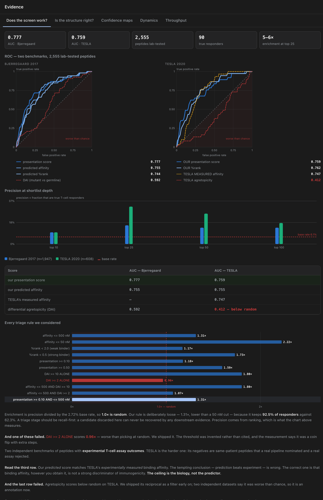

**2,555 peptides that were physically tested on human T-cells.** Not a simulation, not a held-out split of the same dataset — real laboratory outcomes from published studies.

| | Bjerregaard 2017 | TESLA 2020 |
|---|---|---|
| Peptides | 1,947 | 608 |
| True responders | 53 (2.72%) | 37 (6.09%) |
| Negatives | pooled, 13 studies | **same-patient hard negatives** |
| **Our AUC** | **0.777** | **0.759** |
| **Precision @ top 25** | **16%** | **32%** |
| **Enrichment over chance** | **5.9×** | **5.3×** |

TESLA is the harder benchmark by a distance: its negatives are peptides **from the same patients** that expert pipelines nominated and the laboratory rejected. That is the test a real tool faces.

**The result that should stop a judge:** our *predicted* score (0.759) matches TESLA's *experimentally measured* binding affinity (0.747). The tempting reading — prediction beats experiment — is wrong. The correct one is that **binding affinity, however you obtain it, is not a strong discriminator.** The ceiling here is biology, not software. Nobody gets past it by building a better binding predictor, which is exactly why we spend the GPU on structural evidence instead.

**And two things on this screen failed.** The red ROC curve dips *below* the diagonal. The red bar sits inside the shaded worse-than-random zone. Both are ours. Both stayed on the dashboard.

### 4 · Is the structure right — and can you trust the confidence score?

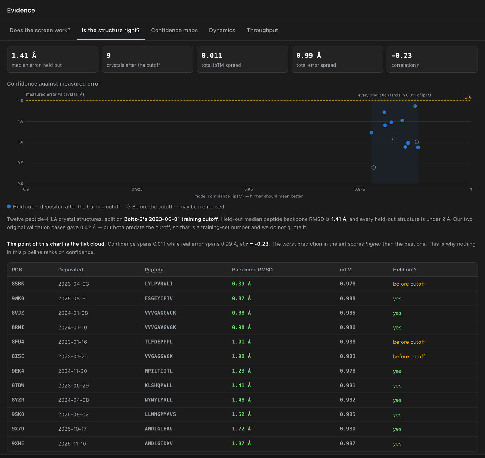

Structure predictors are trained on the Protein Data Bank. Test one on a structure it was trained on and you measure its memory, not its ability.

So we took **nine crystal structures deposited *after* Boltz-2's training cutoff** — genuinely unseen. Median error: **1.41 Å**, and every one under 2 Å. For scale, the crystals themselves were solved at 1.8–2.5 Å resolution: **our prediction error is comparable to the experimental uncertainty of the thing we are comparing against.**

Our two original test cases scored 0.42 Å. Both predate the cutoff. **We do not quote that number.**

> **Now look at the shape of the cloud, because it is the most important chart in this repository.** Every prediction lands within **0.011** of confidence, while the actual error spans a full **Ångström**. Correlation: **r = −0.23**. The *worst* prediction in the set scores *higher* than the best one.
>
> **The analogy:** a tour guide who has walked the same route ten thousand times, asked about a street they have never seen. Same confident tone. The confidence tracks *familiarity with the general shape of the problem*, not correctness on this instance.
>
> This is not a Boltz-2 flaw — it is true of every model of this class, including AlphaFold, and it is why Rosie's owner needed university biologists in the loop. **Nothing in this pipeline ranks on confidence.** We verified this five separate ways, including feeding the model a deliberately mismatched peptide and allele pair: it scored **0.988**, higher than the correct one.

<details>
<summary><b>More panels</b> — confidence maps, dynamics, throughput</summary>

#### Confidence maps

pLDDT banded with AlphaFold's thresholds and hue order (re-tuned for a dark background — see [docs/ARCHITECTURE.md](docs/ARCHITECTURE.md) §6), its four-band distribution beside the mean, and the predicted aligned error using AlphaFold DB's own axis convention.

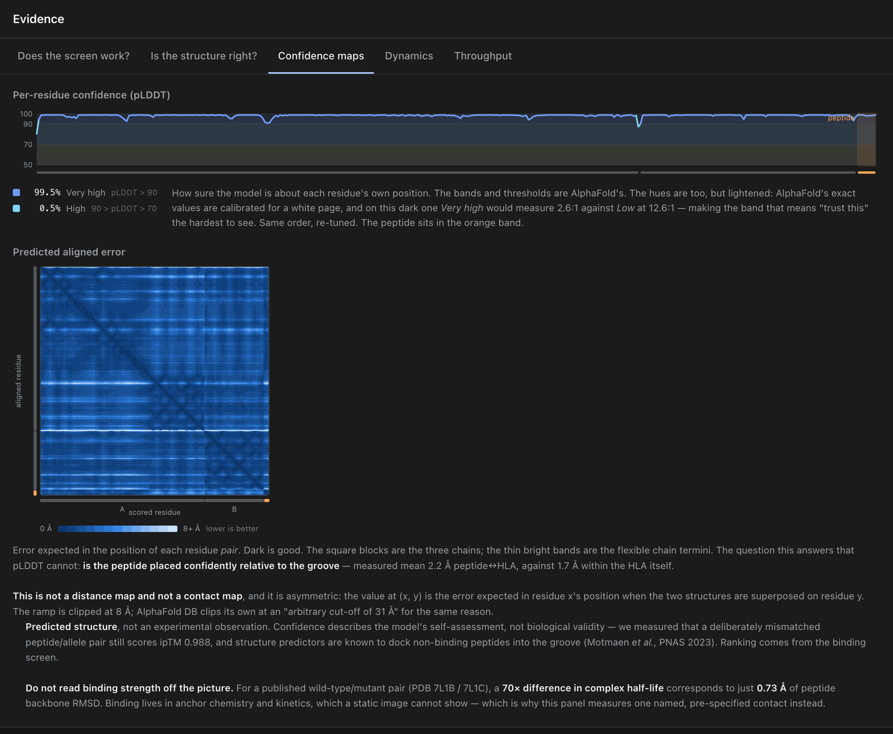

#### Molecular-dynamics stress test

Deliberately one-sided. It can reject a pose the physics immediately breaks; it **cannot** support a stability claim, and it must not be used to corroborate the salt bridge — the solvent model over-stabilises exactly that kind of bond.

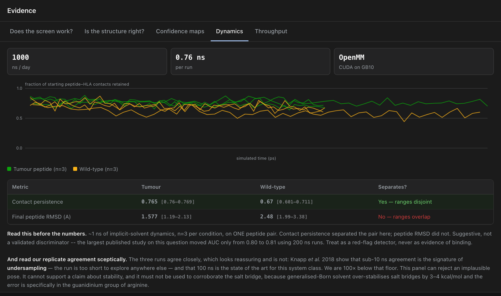

#### Throughput

Measured bars solid, projections hollow and dashed — so the distinction survives a photograph of a slide.

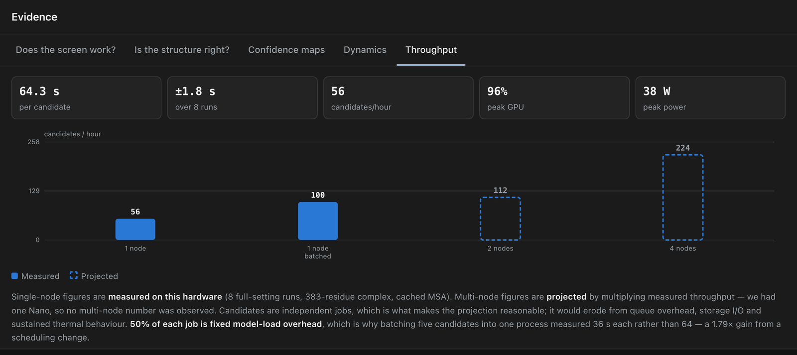

</details>

---

## Performance on one Nano

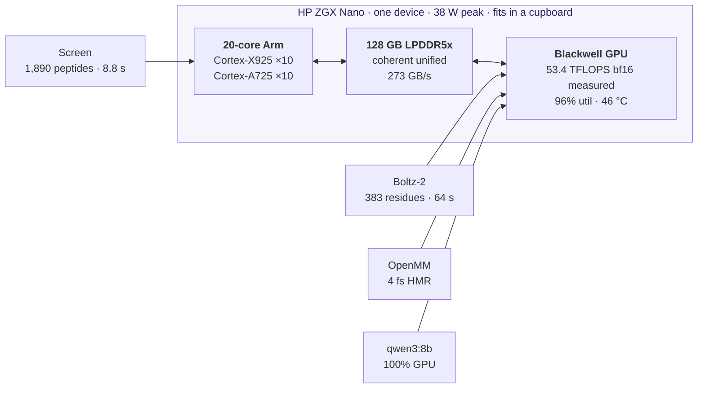

| | Measured |
|---|---|
| Screen 1,890 candidates | **8.8 s** (CPU only, ~430 peptides/s) |
| Structure prediction | **64 s** / candidate (383 residues, cached MSA) |
| Batched throughput | **100 candidates/hour** — 36 s each, 1.79× from loading the model once |
| Full pMHC:TCR complex, 812 residues | 133 s |
| Peak GPU / power / temperature | **96% · 38 W · 46 °C** |
| Sustained compute | **53.4 TFLOPS** bf16 |
| Local language model | qwen3:8b, 100% on GPU, 5.7 tok/s |
| **Full pipeline, network blocked** | **screen 8.8 s → fold 64 s → explain 4 s** |

**Put that in proportion.** A tumour producing 22 shortlisted candidates is about **thirteen minutes of GPU time**. The analysis step stops being a scheduling problem at all.

> **On the vendor number, before anyone asks:** HP's datasheet says **1,000 TOPS FP4** — it never says "1 PFLOP". That figure is NVIDIA's and carries a *"with sparsity"* qualifier, and the two are the same 10¹⁵ ops/s expressed differently, not two separate capabilities. Our workload runs in BF16, so neither is our number. **53.4 TFLOPS is**, and we measured it.

### Scaling

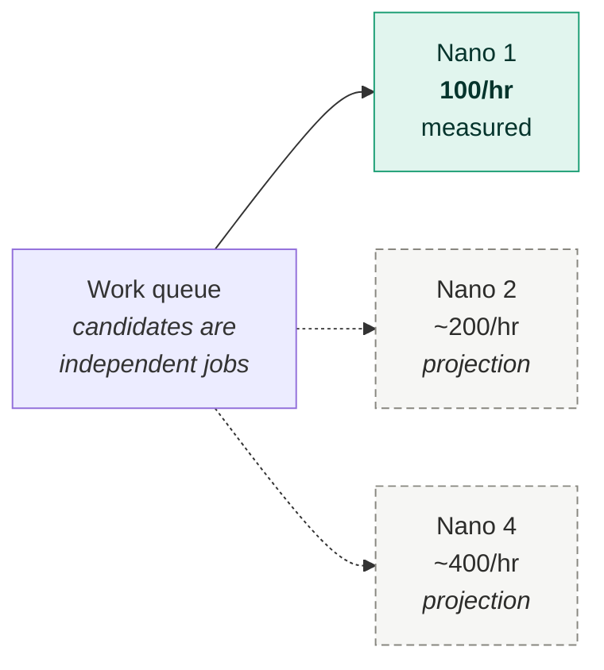

Candidates are independent jobs — no gradients to synchronise, no shared state — so more Nanos is a work queue rather than a rewrite. **We had one Nano**, so every multi-node figure here and in the dashboard is labelled a projection. Published DGX Spark cluster work measures NCCL all-reduce at **~10.2 GB/s, roughly 40% of raw RDMA**, which matters enormously for distributed training and very little for a queue of independent jobs — but knowing which of those you are is what separates a defensible projection from a guess.

---

## Where this could actually go

We are a research prioritisation tool, not a treatment. But the nearest real applications are not hypothetical, and Rosie is the existence proof for the first one.

**Veterinary oncology, now.** Roughly **one in four dogs** develops cancer in its lifetime, rising to about one in two past the age of ten ([AVMA](https://www.avma.org/resources/pet-owners/petcare/cancer-pets), [AAHA](https://www.aaha.org/resources/canine-cancer/)) — and mast cell tumours like Rosie's are the most common canine skin cancer. Veterinary medicine has a shorter regulatory path than human medicine, owners who are highly motivated, and almost no access to this class of analysis. A device a university veterinary school could simply *buy* changes what is possible there — and it is also how the technique accumulates the evidence base it needs before anyone takes it near a human trial.

**Institutions without a genomics core.** The statistic that reframes the whole problem comes from the pancreatic cancer vaccine trial: **only 1 patient in 19 had too few neoantigens to make a vaccine at all.** Candidate *generation* is almost never the failure point. **Prioritisation is.** That means the bottleneck is analysis and expertise — exactly the part that can be packaged into a box and shipped to a hospital that does not have a bioinformatics department.

**Places where the data cannot leave, full stop.** National health services, countries with data-residency laws, paediatric hospitals, indigenous genomic-sovereignty programmes. For these, a cloud pipeline is not expensive or slow — it is **unavailable**. A self-contained device is the only form this capability can take.

**And the honest frame for all three:** the expensive, irreplaceable resource in cancer research is not compute. It is laboratory time, animal lives and patient months. A tool that is five times better than chance at spending them is worth building even though it is wrong most of the time — because the alternative is not certainty, it is chance.

---

## Where the field actually is

We are deliberately restrained about clinical language, because the evidence demands it.

| | |
|---|---|
| **KEYNOTE-942** (mRNA-4157 + pembrolizumab, melanoma) | Improved recurrence-free survival — **two-sided p = 0.053**, confidence interval crossing 1.0 |
| **BioNTech randomised Phase 2**, this modality | **Terminated on futility, August 2026** |
| **Autogene cevumeran**, pancreatic | Median **9.4 weeks** surgery → first dose; immune responses in half of patients |

The science is real and the effect may well be real. But a randomised trial of this exact modality was stopped last month. Any tool in this space that talks about curing anything is overclaiming by orders of magnitude — which is why this one produces **a ranked shortlist for a researcher to review**, and says so on every screen.

---

## What we got wrong

A tool that reports only its successes has not been tested. We found twelve errors in our own work. Here are six.

| # | Error | How it was caught | Fix |
|---|---|---|---|
| 1 | Shipped a filter **worse than random** (enrichment 0.96×) | Validation against 1,947 real assay outcomes | The mutant-vs-normal ratio mostly detects **anchor** mutations — the ones pointing *into* the bun, that no immune cell can see. Demoted to an annotation |
| 2 | Accuracy claim **3× optimistic** | Both validation crystals predate the training cutoff | Re-measured on 9 held-out structures: 1.41 Å, not 0.42 Å |
| 3 | Labelled **a normal human peptide** a tumour target | Built the self-similarity filter afterwards | `ICDFGLARV` is verbatim ERK2. Kept in the demo as the negative control |
| 4 | Our **near-self metric was vacuous** | It flagged literally everything | Every mutated peptide is one letter from its own healthy version. Now excluded |
| 5 | A **test asserted a conclusion our own data refuted** | The wild-type control | "The model knows recognition is harder" was equally true of a complex the receptor does *not* recognise. Test deleted, not repaired |
| 6 | Our **language model asserted three unsupported claims** | Added a claim checker after the first run | Including that a confidence score "supports reliability" — which we had already disproved five times |

The other six — including citing the wrong paper for our own TCR, misdiagnosing a hardware fault twice, and shipping demo inputs with a mixed genome build — are in [docs/SCIENCE.md](docs/SCIENCE.md) §3, each with the mechanism behind it.

Two limits we place on our own headline results:

- **The molecular dynamics run must not be used to support the salt-bridge claim.** Generalised-Born implicit solvent over-stabilises salt bridges by 3–4 kcal/mol, and the documented failure is specifically in the guanidinium group of arginine — Arg156 is exactly the atom type at fault. That caveat is in the tool's output, not just the docs.
- **Our three MD replicates agree closely, and that is not reassuring.** Sub-10 ns agreement is the published signature of *undersampling*, not stability. We are 100× below the state of the art for this system class.

---

## Documentation

| Document | What it covers |
|---|---|
| **README.md** (this file) | Why we built it, what it does, what you are looking at |
| [docs/PROBLEM.md](docs/PROBLEM.md) | The biology, why this is hard, what the field actually achieves |
| [docs/ARCHITECTURE.md](docs/ARCHITECTURE.md) | Pipeline design, module map, data flow, interface provenance |
| [docs/HARDWARE.md](docs/HARDWARE.md) | The GB10, the edge argument in full, telemetry, scaling, the power fault |
| [docs/BENCHMARKS.md](docs/BENCHMARKS.md) | Every measurement, with methodology and caveats |
| [docs/SCIENCE.md](docs/SCIENCE.md) | What we can and cannot claim, and all twelve of our errors |
| [BUILD-GUIDE.md](BUILD-GUIDE.md) | Verified install on the Nano, every bug and its fix |
| [PITCH.md](PITCH.md) | The 4-minute demo script |

---

## Quick start

```bash
uv venv --python 3.12 .venv && source .venv/bin/activate
uv pip install mhcflurry fastapi uvicorn gemmi pytest
mhcflurry-downloads fetch models_class1_presentation
python -m uvicorn app.main:app --port 8420
```

Open <http://127.0.0.1:8420>. **No GPU required** — structure prediction is the only GPU stage, and the predicted structures ship with the repository.

Deep links, for setting up a demo in advance:

```bash
open "http://127.0.0.1:8420/?run=1&tab=pane-holdout"
```

For the full Nano install including Boltz-2, OpenMM and Ollama, see [BUILD-GUIDE.md](BUILD-GUIDE.md) — every step was executed on the hardware, not looked up.

```bash
pytest -q        # 101 tests
```

Regenerating the figures in this README (needs the app running, plus Chrome and Pillow):

```bash
./scripts/screenshots.sh
```

---

## Repository layout

```
neofold-edge/
├── neofold/              # the pipeline, one module per stage
│   ├── variants.py       #   variant file → mutated protein → peptide windows
│   ├── screen.py         #   MHCflurry binding screen, DAI, triage rules
│   ├── selfsim.py        #   human proteome search (is this actually a neoantigen?)
│   ├── expression.py     #   normal-tissue expression as an off-tumour safety flag
│   ├── pipeline.py       #   the funnel
│   ├── structure.py      #   Boltz-2 invocation with the settings that work on GB10
│   ├── validate.py       #   RMSD against crystal structures; ensemble spread
│   ├── contacts.py       #   pre-registered contact measurement
│   ├── md.py             #   OpenMM stability check
│   ├── report.py         #   local LLM summary + two guardrails
│   ├── construct.py      #   polyepitope assembly, exhaustive junction search
│   └── telemetry.py      #   GB10-aware GPU telemetry
├── app/                  # FastAPI server + offline UI (vendored Mol*)
├── tests/                # 101 tests
├── benchmarks/           # every measurement as JSON
├── data/                 # demo variants, reference sequences, proteome, GTEx
├── results/              # predicted structures, MD traces, holdout set
├── scripts/              # Nano setup, offline proof, benchmark + figure runners
├── docs/                 # long-form documentation and its figures
└── research/             # ~12,700 lines of sourced research notes
```

---

## Licence and provenance

The pipeline is ours. The components it orchestrates are not:

| Component | Licence | Role |
|---|---|---|
| [Boltz-2](https://github.com/jwohlwend/boltz) | MIT | biomolecular structure prediction |
| [MHCflurry](https://github.com/openvax/mhcflurry) | Apache 2.0 | peptide–MHC binding prediction |
| [OpenMM](https://openmm.org) | MIT / LGPL | molecular dynamics |
| [Mol*](https://molstar.org) | MIT | 3D molecular viewer |
| [gemmi](https://gemmi.readthedocs.io) | MPL 2.0 | structural file handling |

**Boltz-2 being MIT with open weights is what makes this possible at all.** AlphaFold 3 — the tool Rosie's owner used — has weights that are non-commercial and not approved for clinical use, and its server runs in Google's cloud. An open, locally-runnable model of comparable quality is the single technical development that moves this work from a cloud service to a device you can own.

Benchmark data: Bjerregaard *et al.* 2017 (CC BY), Wells *et al.* 2020 (TESLA), UniProt, GTEx v10, RCSB PDB.

### On Rosie

Details of her case are from [The Scientist](https://www.the-scientist.com/chatgpt-and-alphafold-help-design-personalized-vaccine-for-dog-with-cancer-74227), with the oncologist's cautions from [The Conversation](https://theconversation.com/a-man-used-ai-to-help-make-a-cancer-vaccine-for-his-dog-an-oncologist-urges-caution-278735). We have no affiliation with Paul Conyngham, UNSW or anyone involved. We are simply convinced by the case that the analysis step in that story should not have required a university, a cloud service, or three thousand dollars — and that is what we built.

---

<div align="center">
<sub>Built for Edge AI Hack 2026 · San José State University · sponsored by HP</sub>
</div>
