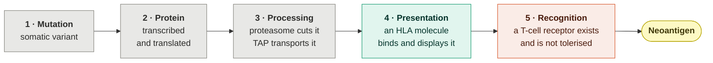
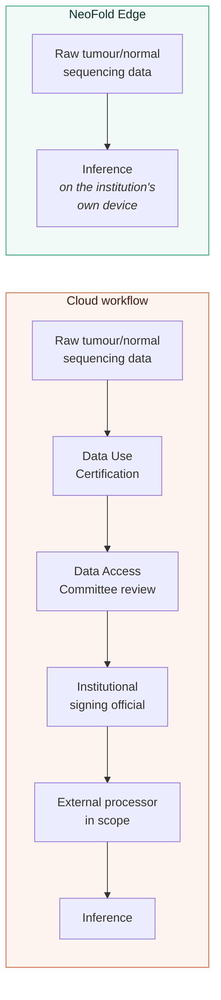
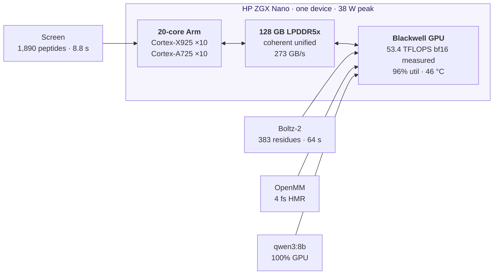
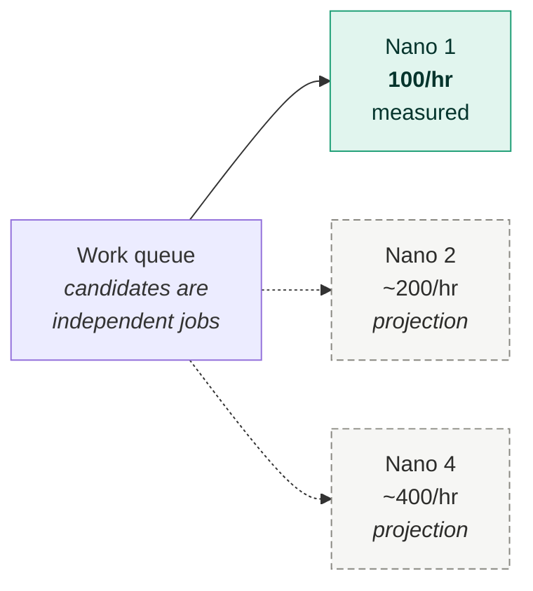

<div align="center">

# NeoFold Edge

**A private, on-premise AI workstation that turns a tumour genome into a small, ranked, explained shortlist of neoantigen research candidates — and tells you how often it is wrong.**

Built for the HP ZGX Nano (NVIDIA GB10 Grace Blackwell). Runs entirely offline: no cloud inference, no external APIs, no data leaving the building.


</div>

> **Research prioritisation only.** Every value this produces is a prediction, not a measurement. This is not a diagnostic, a treatment recommendation, or a vaccine design. Expert review and laboratory validation are required.

---


---

## The one-paragraph version

Cancer mutations create peptides the immune system can, in principle, recognise. Finding which ones is a prediction problem, and most predictions are wrong — in the largest prospective test ever run, **608 carefully-chosen candidates were tested in the laboratory and 37 worked**. NeoFold Edge screens thousands of candidate peptides in seconds on CPU, predicts 3D peptide–HLA structures in about a minute on the GB10, measures a contact specified in advance from a crystal structure, and writes a plain-language evidence summary with a local language model. Every number it reports has been validated against experimental data, and the failures are documented alongside the successes.

## The three numbers that matter

| Claim | Measured | How |
|---|---|---|
| **The screen ranks usefully** | **AUC 0.777 / 0.759** | 2,555 peptides with experimental T-cell assay outcomes, across two independent benchmarks |
| **The structures are accurate** | **1.41 Å median** | 9 crystal structures deposited *after* the model's training cutoff |
| **It runs on one Nano, offline** | **8.8 s + 64 s** | 1,890 candidates screened, then one structure folded, with all network egress blocked |

Every one of these is reproducible from this repository. See [docs/BENCHMARKS.md](docs/BENCHMARKS.md).

## Table of contents

| Document | What it covers |
|---|---|
| **README.md** (this file) | The problem, the approach, the headline results |
| [docs/PROBLEM.md](docs/PROBLEM.md) | The biology, why this is hard, what the field actually achieves |
| [docs/ARCHITECTURE.md](docs/ARCHITECTURE.md) | Pipeline design, module map, data flow, interface provenance |
| [docs/HARDWARE.md](docs/HARDWARE.md) | The GB10, why edge compute, measured telemetry, scaling, the power fault |
| [docs/BENCHMARKS.md](docs/BENCHMARKS.md) | Every measurement, with methodology and caveats |
| [docs/SCIENCE.md](docs/SCIENCE.md) | What we can and cannot claim, and the errors we found in our own work |
| [BUILD-GUIDE.md](BUILD-GUIDE.md) | Verified install on the Nano, every bug and its fix |
| [PITCH.md](PITCH.md) | The 4-minute demo script |

---

## The problem

A tumour accumulates mutations. Some produce altered proteins; some of those are chopped up and displayed on the cell surface by HLA molecules; a few of those displayed fragments look foreign enough that a T-cell can recognise them. Those few are **neoantigens** — and every one of five gates has to open:



**Gate 4 is what computational tools are good at.** Twenty-five years of binding assays; our screen scores AUC 0.777 there.

**Gate 5 is where everything falls apart.** Whether a receptor exists in a given person's repertoire is not in any training data, because nobody can measure a repertoire at scale.

The arithmetic that follows:

| Study | Candidates tested in the lab | Immunogenic | Rate |
|---|---|---|---|
| **TESLA** — Wells *et al.*, *Cell* 2020 | 608, top-ranked by 25 independent pipelines | **37** | **6.1%** |
| **Bjerregaard** *et al.* 2017 — 13 pooled studies | 1,947 neopeptide–HLA pairs | **53** | **2.7%** |

Those 608 were not a random sample. They were the *best* candidates 25 research groups could nominate. So the honest goal is not "find the neoantigen" — it is **take a thousand candidates down to a handful a lab can afford to test, be several times better than chance, and be explicit about the residual error.**

---

## How it works


**Teal = local CPU. Purple = GB10 GPU. Grey = data. Coral = output.**

One run, end to end, with measured timings:


Each stage is a separate module with its own tests. Full design rationale in [docs/ARCHITECTURE.md](docs/ARCHITECTURE.md).

---

## The dashboard

Offline FastAPI app with a vendored Mol\* viewer. Every convention in it — the pLDDT bands, the ipTM bands with AlphaFold 3's named *grey zone*, the two-thirds detail split, the validation-slider idiom — is a **measured value** read from the live DOM of AlphaFold DB, AlphaFold Server, RCSB, PDBe and Benchling, not an approximation.

### The funnel and the candidate list

1,890 candidates down to 22, with the attrition encoded rather than implied. Note the log bar behind each affinity, and **`ICDFGLARV` flagged `self peptide`** — a KIT D816V "neoantigen" that is a verbatim match to ERK2.


### The structure and the pre-registered contact

HLA-C\*08:02 has a charged pocket at peptide position 3. KRAS G12D puts an aspartate exactly there. The crystal shows a 2.7 Å salt bridge to Arg156; we predict **2.5 Å**. The germline peptide has **glycine** — no side chain, so the contact cannot form at all.


### Does the screen actually work?

ROC on both benchmarks, precision at shortlist depth, and every triage rule as enrichment over the base rate. **Two things on this screen failed**: the red ROC curve crosses *below* the diagonal, and the rule we shipped first measures 0.96× — inside the shaded worse-than-random zone.


### Is the structure right?

Nine crystals deposited *after* the model's training cutoff. The point is the shape of the cloud: **confidence spans 0.011 while real error spans a full Ångström**, at r = −0.23. The worst prediction in the set scores *higher* than the best one.


<details>
<summary><b>More panels</b> — confidence maps, dynamics, throughput</summary>

#### Confidence maps

pLDDT banded with AlphaFold's thresholds and hue order (re-tuned for a dark ground — see [docs/ARCHITECTURE.md](docs/ARCHITECTURE.md) §6), its four-band distribution beside the mean, and the predicted aligned error with AFDB's axis convention.


#### Molecular-dynamics stress test

A one-sided filter. It can reject an implausible pose; it cannot support a stability claim, and it must not be used to corroborate the salt bridge.


#### Throughput

Measured bars solid, projections hollow and dashed — so the distinction survives a photograph of a slide.


</details>

---

## Why the edge, specifically

This is not a latency story. Nobody needs a neoantigen shortlist in 50 milliseconds.



**A correction we insist on.** The cost argument is weak and we do not make it: moving a whole-exome tumour/normal pair costs roughly **$5** in egress. And **DNA is not one of HIPAA's 18 Safe Harbor identifiers** — a claim that circulates widely and is checkable in the CFR in thirty seconds. Item (P) is fingerprints and voice prints.

The real argument is narrower and it holds: **moving the file converts a local computation into a regulated disclosure.** Local compute *removes* a governance step rather than satisfying one.

Full treatment, with the genomic re-identification literature and its scope limits, in [docs/HARDWARE.md](docs/HARDWARE.md).

---

## Results

### The screen, against experimental T-cell data

| | Bjerregaard 2017 | TESLA 2020 |
|---|---|---|
| Peptides | 1,947 | 608 |
| True responders | 53 (2.72%) | 37 (6.09%) |
| Negatives | pooled, 13 studies | **same-patient hard negatives** |
| **Our AUC** | **0.777** | **0.759** |
| **Precision @ top 25** | **16%** | **32%** |
| **Enrichment** | **5.9×** | **5.3×** |

Two observations worth stating plainly:

1. **Our predicted score matches TESLA's *experimentally measured* binding affinity** (0.759 vs 0.747). The honest reading is not that prediction beats experiment — it is that **binding affinity, however obtained, is not a strong discriminator of immunogenicity**. The ceiling is the biology.
2. **The mutant-versus-germline differential scores 0.412 on TESLA — below random.** We shipped it as a filter. The data says it was worse than chance, so it is an annotation now, not a gate.

### Structure prediction, held out

| Set | n | Median peptide backbone RMSD |
|---|---|---|
| Pre-cutoff, possibly memorised | 3 | 1.01 Å |
| **Post-cutoff, held out** | **9** | **1.41 Å** (all under 2 Å) |
| Full pMHC:TCR complex, 812 residues | 1 | TCR α 1.42 Å, TCR β 1.50 Å |

We quote **1.41 Å**, the held-out figure. Our two original validation anchors gave 0.42 Å — but both predate the training cutoff, so that number is a training-set result and labelled as one.

### On the Nano



| | Measured |
|---|---|
| Structure prediction | 64 s / candidate (383 residues, cached MSA) |
| Batched throughput | **100 candidates/hour** (36 s each — the checkpoint loads once, 1.79×) |
| Peak GPU | **96% utilisation, 38 W**, 46 °C |
| Raw compute | 53.4 TFLOPS bf16 sustained |
| Local LLM | qwen3:8b, 100% GPU, 5.7 tok/s |
| Full offline pipeline | screen 8.8 s → structure 64 s → summary 4 s |

**On the vendor figure:** HP's datasheet says 1,000 TOPS FP4, not "1 PFLOP" — the petaFLOP number is NVIDIA's and carries a *"with sparsity"* qualifier. They are the same 10¹⁵ ops/s, not two capabilities. Our workload runs in BF16, so neither is our number. 53.4 TFLOPS is.

### Scaling



**We had one Nano.** No multi-node number was observed, and every one in the UI is labelled a projection. There is no gradient to synchronise, which is what makes the projection reasonable — but published DGX Spark cluster work measures NCCL all-reduce at **~10.2 GB/s, about 40% of raw RDMA**, and that distinction is exactly what separates a projection you can defend from a guess.

---

## What we got wrong

This section exists deliberately. A tool that reports only its successes has not been tested.

| # | Error | How it was caught | Fix |
|---|---|---|---|
| 1 | Shipped a filter **worse than random** (DAI ≥ 2, enrichment 0.96×) | Validation against 1,947 assay outcomes | Demoted to an annotation — the differential detects *anchor* mutations, which are the ones T-cells are least likely to see |
| 2 | Accuracy claim **3× optimistic** | Both validation crystals predate the training cutoff | Re-measured on 9 held-out structures: 1.41 Å |
| 3 | Labelled **a normal human peptide** a tumour target | Self-similarity filter added afterwards | `ICDFGLARV` occurs verbatim in ERK2 — the DFG motif is conserved across the kinome. Kept as the demo's negative control |
| 4 | Our **near-self metric was vacuous** | Every candidate trivially flagged | Every missense neoepitope is 1 mismatch from its own germline peptide; now excluded |
| 5 | A **test asserted a conclusion our own data refuted** | Wild-type TCR control | "The model knows recognition is harder" holds equally for a complex the TCR does *not* recognise. Test deleted, not repaired |
| 6 | The **LLM asserted three unsupported claims** | Added a claim checker after the first run | Including that ipTM "supports reliability" — which we had already disproved five times |

Those are six of **twelve**. The rest — including citing the wrong paper for our own TCR, diagnosing a hardware fault wrongly twice, and shipping demo input files with a mixed genome build — are in [docs/SCIENCE.md](docs/SCIENCE.md) §3, each with the mechanism that caused it.

Two constraints we place on our own headline results:

- **The molecular dynamics run must not be used to support the salt-bridge claim.** Generalised-Born implicit solvent over-stabilises salt bridges by 3–4 kcal/mol, and the failure is specifically in guanidinium groups — Arg156 is exactly the atom type at fault. That caveat is in the tool's own output, not just the documentation.
- **Our three MD replicates agree closely, and that is not good news.** Knapp *et al.* (2018) show sub-10 ns agreement is the signature of undersampling, not stability. We are 100× below the field's state of the art for this system class.

---

## Quick start

```bash
uv venv --python 3.12 .venv && source .venv/bin/activate
uv pip install mhcflurry fastapi uvicorn gemmi pytest
mhcflurry-downloads fetch models_class1_presentation
python -m uvicorn app.main:app --port 8420
```

Open <http://127.0.0.1:8420>. The app needs no GPU — structure prediction is the only GPU stage, and precomputed structures ship with the repo.

Deep links, for setting a demo up in advance:

```bash
open "http://127.0.0.1:8420/?run=1&tab=pane-holdout"
```

For the full Nano install including Boltz-2, OpenMM and Ollama, see [BUILD-GUIDE.md](BUILD-GUIDE.md) — every step was executed, not looked up.

```bash
pytest -q        # 101 tests
```

Regenerating the figures in this README (needs the app running, plus Chrome and Pillow):

```bash
./scripts/screenshots.sh
```

---

## Repository layout

```
neofold-edge/
├── neofold/              # the pipeline, one module per stage
│   ├── variants.py       #   variant file → mutated protein → peptide windows
│   ├── screen.py         #   MHCflurry binding screen, DAI, triage rules
│   ├── selfsim.py        #   human proteome search (is this actually a neoantigen?)
│   ├── expression.py     #   normal-tissue expression as an off-tumour safety flag
│   ├── pipeline.py       #   the funnel
│   ├── structure.py      #   Boltz-2 invocation with the settings that work on GB10
│   ├── validate.py       #   RMSD against crystal structures; ensemble spread
│   ├── contacts.py       #   pre-registered contact measurement
│   ├── md.py             #   OpenMM stability check
│   ├── report.py         #   local LLM summary + two guardrails
│   ├── construct.py      #   polyepitope assembly, exhaustive junction search
│   └── telemetry.py      #   GB10-aware GPU telemetry
├── app/                  # FastAPI server + offline UI (vendored Mol*)
├── tests/                # 101 tests
├── benchmarks/           # every measurement as JSON
├── data/                 # demo variants, reference sequences, proteome, GTEx
├── results/              # predicted structures, MD traces, holdout set
├── scripts/              # Nano setup, offline proof, benchmark + figure runners
├── docs/                 # the long-form documentation and its figures
└── research/             # ~12,700 lines of sourced research notes
```

---

## Licence and provenance

The pipeline code is ours. The components it orchestrates are not:

| Component | Licence | Role |
|---|---|---|
| [Boltz-2](https://github.com/jwohlwend/boltz) | MIT | biomolecular structure prediction |
| [MHCflurry](https://github.com/openvax/mhcflurry) | Apache 2.0 | peptide–MHC binding prediction |
| [OpenMM](https://openmm.org) | MIT / LGPL | molecular dynamics |
| [Mol*](https://molstar.org) | MIT | 3D molecular viewer |
| [gemmi](https://gemmi.readthedocs.io) | MPL 2.0 | structural file handling |

Boltz-2 being **MIT with open weights** is what makes this possible at all — AlphaFold 3's weights are non-commercial and not approved for clinical use.

Benchmark data: Bjerregaard *et al.* 2017 (CC BY), Wells *et al.* 2020 (TESLA), UniProt, GTEx v10, RCSB PDB.

---

<div align="center">
<sub>Built for Edge AI Hack 2026 · San José State University · sponsored by HP</sub>
</div>
