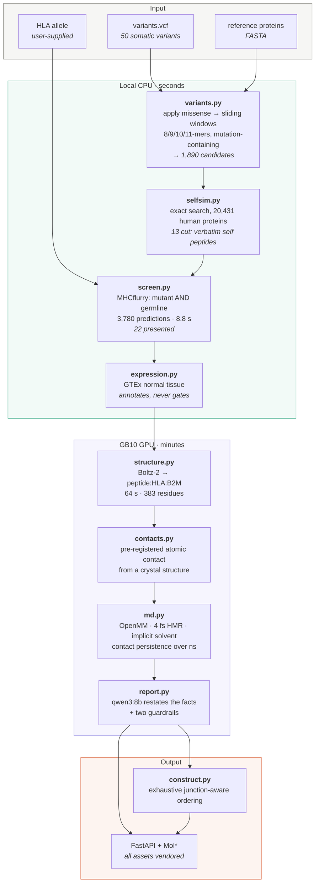
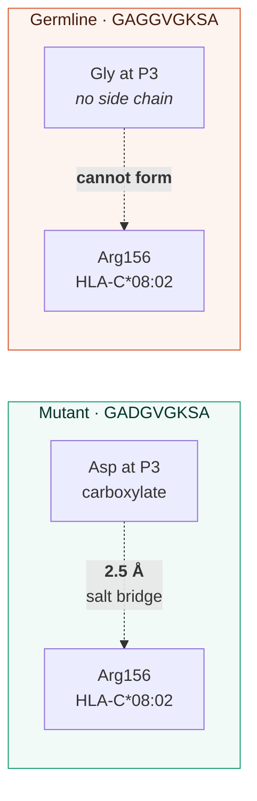

# Architecture

*How the system is put together, what runs where, and why each layer exists.*

---

## 1. The governing idea: a funnel, cheapest filter first

Structure prediction costs **64 seconds per candidate on a GB10**. The binding screen costs **2.3 milliseconds per candidate on a CPU**. That is a factor of roughly 28,000.

Every design decision follows from that ratio. Work is ordered so that the expensive stages only ever see candidates that survived the cheap ones, and so that a stage which cannot discriminate is never used as a filter.



---

## 2. Module map

Twelve modules, 2,493 lines. Each owns one stage and is tested independently (125 tests, 1,234 lines).

| Module | Lines | Responsibility | The non-obvious part |
|---|---|---|---|
| `variants.py` | 219 | VCF → mutated protein → peptide windows | Asserts the reference amino acid at the variant position **matches the FASTA**. Catches wrong-isoform and wrong-accession errors, which are otherwise silent and produce confidently wrong peptides. |
| `screen.py` | 364 | MHCflurry wrapper, thresholds, DAI, triage | `triage()` gates on **presentation only**. DAI is computed and displayed but does not filter — see [SCIENCE.md](SCIENCE.md) §1. |
| `selfsim.py` | 211 | Search the reviewed human proteome | Exact match via substring search over one concatenated blob with `*` separators; near-match via a half-length seed index. `find_near()` takes `exclude=wild_type` — without it the metric is vacuous. |
| `expression.py` | 149 | GTEx normal-tissue expression | Deliberately **inverted**: high expression is a warning, not a qualification. `is_gate: false` is in the output. |
| `pipeline.py` | 167 | The funnel | Two-pass self-similarity: exact over everything (cheap, disqualifying), near-self over the shortlist only (expensive, flagging). |
| `structure.py` | 149 | Boltz-2 invocation | Carries the settings that actually work on GB10, including `--num_workers 0`. See §5. |
| `validate.py` | 189 | RMSD vs. crystal; ensemble spread | **Superposes on the MHC heavy chain first**, then measures the peptide. Without this you measure rigid-body tumbling — which is how we once "rejected" a validated epitope at 7 Å. |
| `contacts.py` | 151 | Measure one named contact | The contact is specified **before** prediction, from a published crystal structure. A measurement chosen after seeing the answer is not a measurement. |
| `md.py` | 271 | OpenMM stability check | amber14 + OBC2 implicit solvent, hydrogen mass repartitioning for a 4 fs timestep, 310 K. Kabsch superposition per frame. |
| `report.py` | 240 | Local LLM evidence summary | Two guardrails: numeric verification against the input facts, and a banned-claims list. The disclaimer is **concatenated by code**, never generated. |
| `construct.py` | 270 | Polyepitope ordering | Exhaustive permutation search over epitope order (n ≤ 7 = 5,040 orderings) minimising newly-created junctional binders, with junction-level caching. |
| `telemetry.py` | 113 | GPU telemetry | GB10-aware: `nvidia-smi memory.total` returns N/A on unified memory, so per-process queries are used instead. |

---

## 3. Data flow, concretely

What the demo actually does, with real numbers from a run:

```
data/demo/variants.vcf          50 somatic missense variants
        │
        ├── read_fasta()        reference protein sequences
        ▼
build_candidates()              apply_missense() per variant,
                                then all mutation-containing
                                windows of length 8, 9, 10, 11
        ▼
        1,890 candidate peptides
        │
        ▼
SelfProteome.find_exact()       20,431 reviewed human proteins
        │                       concatenated into one searchable blob
        ├──► 13 disqualified    "occurs verbatim in the normal proteome"
        ▼                        e.g. ICDFGLARV → ERK2 (conserved DFG motif)
PeptideScreen.score_pairs()     MHCflurry presentation predictor,
        │                       mutant AND germline: 3,780 predictions
        │                       8.8 s wall, ~430 peptides/s
        ├──► presentation ≥ 0.10 AND affinity ≤ 500 nM
        ▼
        22 predicted-presented
        │
        ├── NormalExpression.check()    GTEx flag per source gene
        ├── SelfProteome.find_near()    1-mismatch, cognate WT excluded
        ▼
rank_for_structure()            top 5 → GPU stage
        ▼
Boltz-2 (GB10)                  peptide + HLA α + β2M = 383 residues
        │                       64 s each, cached MSA
        ▼
measure_salt_bridge()           Asp3(peptide) ↔ Arg156(HLA-C*08:02)
        │                       pre-registered from crystal 6ULN
        ▼
OpenMM (GB10)                   contact persistence over ns
        ▼
qwen3:8b (GB10, Ollama)         plain-language restatement, 4 s
        │                       → verified, or rejected with reasons
        ▼
assemble()                      junction-aware construct ordering
```

---

## 4. The evidence layer

This is the part that distinguishes the system from a ranked list, and it is built around a single principle: **measure something specified in advance.**

### 4.1 The pre-registered contact

KRAS G12D produces the peptide `GADGVGKSA` presented on HLA-C\*08:02. Crystal structure 6ULN shows why it binds: HLA-C\*08:02 has a positively charged pocket, and the G12D mutation places an aspartate at peptide position 3, forming a **2.7 Å salt bridge to Arg156**.

That contact was written down before we predicted anything. Our prediction measures **2.5 Å**.

The wild-type peptide has glycine at that position. Glycine has no side chain. The contact cannot form — not weakly, at all. This is a structural, mechanistic, falsifiable statement about why one peptide binds and the other does not, and it is the kind of statement a confidence score can never make.



### 4.2 Molecular dynamics as a stability check

A predicted structure is one static frame. Molecular dynamics asks whether it survives being at body temperature.

Settings: amber14 force field, OBC2 implicit solvent, 310 K, hydrogen mass repartitioning to permit a 4 fs timestep, 1.8 nm cutoff, 10 ps equilibration. Contact persistence is the fraction of frames in which the pre-registered contact stays within 0.45 nm.

**The trap we fell into:** the first MD run "rejected" the validated mutant complex at 7 Å RMSD. The cause was not the physics. In implicit solvent there is no periodic box holding the complex still, so the whole assembly tumbles, and a naive RMSD measures the tumbling. The fix is Kabsch superposition of the MHC heavy chain on each frame before measuring the peptide. This is exactly the same bug class as §2's `validate.py` note, found twice in two different modules.

### 4.3 The ternary complex

The step after presentation is recognition. We predicted the full pMHC:TCR complex from PDB 6ULN — **TCR9d**, patient 3995, Sim *et al.* (*PNAS* 2020) — 812 residues, 5 chains, **133 seconds**:

| Chain | Cα RMSD |
|---|---|
| Peptide | **0.32 Å** |
| β2-microglobulin | 0.46 Å |
| TCR α | **1.42 Å** |
| TCR β | **1.50 Å** |

Getting a T-cell receptor's docking geometry to 1.5 Å is a real result. **It is also not immunogenicity.** Predicting where a *known* receptor sits says nothing about whether a given person's repertoire contains one. We state this in the output.

A trap worth recording: the TCR initially appeared 72 Å out of place. 6ULN's biological assembly applies operator 1 to the pMHC chains and operator 2 to the TCR chains; comparing against the asymmetric unit is comparing against the wrong thing. After `gemmi.make_assembly`, 1.42 / 1.50 Å.

### 4.4 The local language model, and why it is fenced in

The model does exactly one job: turn a row of numbers into a paragraph. It computes nothing and decides nothing. Two guardrails enforce that:

**Numeric verification** — every numeric token in the output is checked against the facts that went in. Lenient about rounding (74 for 74.065 is restating), strict about magnitude, and small integers under 20 are ignored as prose.

**Banned claims** — a phrase list. This exists because the model *passed* numeric verification on its first run while asserting three things the evidence does not license: that the differential showed "enhanced immunogenic potential", that a percentile rank showed "rarity within the human proteome", and that ipTM "supports the reliability" of the interaction. The third is contradicted by our own five measurements. All three phrases are now regression tests.

The disclaimer is a module-level constant concatenated by code, so it cannot drift.

If Ollama is unavailable, `fallback_summary()` emits a deterministic template — and being a template, it is honest about being one. The demo does not depend on a language model being up.

---

## 5. Running Boltz-2 on GB10: the settings that matter

The GB10 is aarch64 with CUDA 13. Most of the ML ecosystem assumes x86-64 with CUDA 12. Six distinct install problems had to be solved; all are documented step-by-step in [BUILD-GUIDE.md](../BUILD-GUIDE.md). The ones that affect *runtime* configuration:

| Setting | Value | Why |
|---|---|---|
| `--num_workers` | **0** | **The single most important flag.** With any other value, the dataloader deadlocks silently: the process sits at 0% GPU forever, with no error and no timeout. |
| `--recycling_steps` | 3 | Default; 0 saves 16 s and costs accuracy |
| `--sampling_steps` | 200 | Default |
| `--diffusion_samples` | 1 | More samples for ensemble spread only |
| MSA | cached per patient | HLA and β2M MSAs are identical across candidates. Generating one costs 132 s vs. 64 s total with a cached one. |
| GPU clocks | `sudo nvidia-smi -lgc 0,2450` | See [HARDWARE.md](HARDWARE.md) §5 — the machine powers off above ~2500 MHz. **Does not survive reboot.** |

---

## 6. The application layer

FastAPI, with one hard constraint: **nothing may be fetched from the internet at runtime.** That constraint is load-bearing for the demo — the pitch claims full offline operation and `scripts/verify_offline.sh` proves it.

What that means concretely:

- **Mol\* 5.11.0 is vendored**, not CDN-loaded (`app/static/vendor/`, with a `VERSION` file).
- **`docs_url=None`** — FastAPI's Swagger UI pulls its own assets from jsDelivr. Leaving it enabled means an unstyled page and a failed request the moment egress is blocked.
- No web fonts, no analytics, no external icon sets.
- Chain styling uses **MolViewSpec** (`loadMvsData`) rather than imperative Mol\* calls, which keeps the viewer config declarative and diffable.

### Design, and where it comes from

The interface is not styled to taste. Two research passes read the **live DOM** of AlphaFold DB, AlphaFold Server, RCSB PDB, PDBe, the EMBL-EBI Visual Framework and Benchling's production stylesheet, and the conventions below are measured values from those pages rather than approximations of them.

| Decision | Source |
|---|---|
| **pLDDT thresholds and hue order** | Sampled from the AlphaFold DB legend and cross-checked against Mol\*'s `plddt.ts`. *(Not the ColabFold values, which are close enough to look like a typo of these.)* **The exact hexes are ours** — see below. |
| **ipTM bands, including the named grey zone** | AlphaFold 3's own, verbatim from the AlphaFold Server FAQ: > 0.8 confident, 0.6–0.8 *"a grey zone where predictions could be correct or incorrect"*, < 0.6 likely failed |
| **Neutral-grey surfaces, alpha-white hairlines, desaturated accent** | AlphaFold Server's measured tokens (`#131314` page, `rgba(255,255,255,.1)` borders, `#A8C7FA` accent) — it is DeepMind's own dark structural-biology product |
| **Detail column gets two-thirds** | RCSB's `col-lg-4` / `col-lg-8` split |
| **Value outside the bar, poles labelled** | The wwPDB validation slider, which turns a raw number into a position against a named reference population |
| **`tabular-nums` everywhere numeric; identity column by ink strength, not weight; `12px 24px 12px 14px` cell padding** | Benchling's production CSS |
| **Discrete bins, and value + uncertainty in one mark** | Correll *et al.*, CHI 2018 — superimposed beats juxtaposed (p = 0.02), discrete beats continuous (p < 0.01) |

**Where we deliberately deviate, and why.** AlphaFold's palette is calibrated against a **white** page. Measured against our `#1b1b1b` card surface:

| Band | Canonical | Contrast on our surface |
|---|---|---|
| Very high — *trust this* | `#0053D6` | **2.63 : 1** — fails the 3 : 1 non-text floor |
| High | `#65CBF3` | 9.34 : 1 |
| Low — *do not trust* | `#FFDB13` | **12.63 : 1** — the brightest thing on screen |
| Very low | `#FF7D45` | 6.78 : 1 |

That is an **inverted encoding**: the band meaning "this is reliable" is the hardest to see and the band meaning "this is not" dominates, with a 4.8× spread. The same is true of the ipTM track — the house diverging anchors put both *decided* bands below the floor (2.51 and 2.92) while the *undecided* grey zone sits at 7.33, nearly 3× brighter than either. "We don't know" should not be the loudest element in a confidence component.

So we keep the thresholds, the hue order and the names, and re-tune the values for a dark ground: `#6E9BF2 / #7FD4F5 / #E5C33F / #F2895A`, every band ≥ 6.2 : 1 with the spread down to 1.7×. The canonical hex is retained as `afHex` in `PLDDT_BANDS` for anyone rendering on white, and the UI caption states the deviation and the reason. Copying a reference palette onto a background it was not measured for is cargo-culting, not fidelity.

**A correctness bug this research found in our own CSS.** Seven rules applied `text-transform: uppercase`. Our HTML correctly authored `nM`, `ipTM`, `pLDDT`, `pTM`; the page rendered `NM`, `IPTM`, `PLDDT`, `PTM`. **`nM` is nanomolar. `NM` is not a unit.** The lower-case prefixes in pLDDT (*predicted*) and ipTM (*interface*) are the load-bearing part of the name. Exactly one class may now uppercase, and it may never touch a unit, a metric name, a peptide, a gene, an allele or an accession.

### What each panel has to earn

Every chart answers a question that has been put to us, or that we expect:

| Panel | The question |
|---|---|
| **Funnel** | "How much does it actually remove?" — attrition is printed between steps (−98.8%), and removals are visually distinct from survivors |
| **Screening landscape** | "Is your shortlist a lucky corner?" — every scored peptide, with the triage rule drawn as the threshold lines |
| **Candidate table** | "What did it pick, and by what key?" — sortable, with the ranking key and the truncation stated in a caption |
| **Selected candidate** | "Can a T-cell even see the mutation?" — a per-residue track marking anchor vs TCR-facing positions |
| **ipTM band** | "Is 0.99 good?" — against AlphaFold 3's own scale, at two decimals, because our own data records a mismatched pair at 0.988 |
| **ROC, both benchmarks** | "Does the screen work?" — and the sub-diagonal region is shaded, so TESLA's agretopicity curve is visibly below chance |
| **Enrichment bars** | "Which rules did you try?" — all of them, including the one we shipped that scores 0.96× |
| **Confidence vs error** | "Isn't 1.41 Å just memorisation, and shouldn't you rank on confidence?" — held-out only, and the cloud is flat |
| **pLDDT distribution** | "What's behind that mean?" — the four-band breakdown, AlphaFold DB's pattern |
| **MD traces** | "Does the pose survive body temperature?" — with the caveats attached to the artefact, not to a paragraph elsewhere |
| **Throughput** | "Does this scale?" — measured bars solid, projections hollow and dashed, so the distinction survives a photograph of a slide |

### Endpoints

| Endpoint | Returns |
|---|---|
| `POST /api/triage` | run the funnel; full per-candidate table with tier and reason |
| `GET /api/structures` | available predicted structures |
| `GET /api/structure/{name}` | mmCIF bytes |
| `GET /api/compare` | mutant vs. germline, side by side |
| `GET /api/contact/{name}` | the pre-registered contact measurement |
| `GET /api/confidence/{name}` | PAE / pLDDT matrices for plotting |
| `GET /api/validation` | held-out crystal comparison |
| `GET /api/benchmark` | AUC, precision@k, enrichment tables |
| `GET /api/md` | MD traces |
| `GET /api/gpu` | live GB10 telemetry |
| `GET /api/network` | **outbound connection count — the offline proof, on screen** |
| `GET /api/alleles` | searchable supported allele list |

A startup thread warms the MHCflurry models and the proteome seed index, so the first triage is not 25 seconds slower than the rest.

---

## 7. What is deliberately *not* here

| Not implemented | Why |
|---|---|
| **HLA typing from reads** | You cannot get an HLA type from a VCF. Real pipelines type it from sequencing reads. We take it as input and say so. |
| **RNA expression of the tumour** | The most serious omission — worth 11–13 precision points in published work. Needs tumour RNA-seq, which our demo input does not include. |
| Clonality / variant allele frequency | Needs read depth and purity estimates |
| Peptide–MHC stability prediction | A separate model; TESLA measured it at AUC 0.686 |
| Proteasomal cleavage and TAP transport | Weak signal in published benchmarks; would add stages without measured benefit |
| Class II / CD4 epitopes | A different prediction problem |
| **Nucleotide sequences** | The construct module emits amino acids only. Emitting an orderable nucleotide sequence is a line we do not cross. |
| Multi-node execution | We had one Nano. Every multi-node number in the UI is labelled a projection. |

The omissions are ranked by measured effect size in [SCIENCE.md](SCIENCE.md) §5, because "what did you leave out" is the first question a competent reviewer asks.

---

## 8. Testing

```bash
pytest -q        # 125 tests
```

The tests worth knowing about:

- `test_variants.py` — the reference-assertion path, so a wrong isoform fails loudly.
- `test_dai.py` — the Łuksza damping formula, and the anchor/TCR-facing site classifier.
- `test_selfsim.py` — including the `exclude=wild_type` behaviour, which is the difference between a real metric and a vacuous one.
- `test_report.py` — the three phrases the LLM actually emitted are frozen as regression cases.
- `test_construct.py` — exhaustive-search correctness.
- `test_tcr.py` — biological-assembly handling, so the 72 Å bug cannot return.

One test had to be **deleted** rather than fixed: it asserted that the model "knows recognition is harder" because the pMHC:TCR ipTM was lower than the peptide-only ipTM. Our own wild-type control showed the same drop for a complex the receptor does *not* recognise. The observation was real; the conclusion was not licensed.
