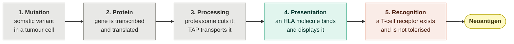

# The problem

*Why neoantigen prediction is hard, what the field actually achieves, and what a tool can honestly promise.*

---

## 1. The biology, in five steps

A tumour cell is a human cell with a corrupted genome. Most of those corruptions are invisible to the immune system. A few are not, and the path from mutation to immune recognition has five gates — every one of which must open:

**Gate 4 is the one computational tools are good at.** Twenty-five years of peptide–HLA binding assays have produced hundreds of thousands of measurements, and the neural networks trained on them are genuinely strong. Our own screen scores AUC 0.777 on this axis.

**Gate 5 is where everything falls apart.** Whether a T-cell receptor exists in a given person's repertoire, has escaped thymic negative selection, and can engage that particular peptide–HLA surface — this is not in the training data, because nobody can measure a repertoire at scale. It is the gap between "presented" and "immunogenic", and it is enormous.

---

## 2. How big the gap is

These are the numbers that should frame any claim about neoantigen prediction.

| Study | Candidates tested in the lab | Immunogenic | Rate |
|---|---|---|---|
| **TESLA** — Wells *et al.*, *Cell* 2020 | 608, top-ranked by 25 independent pipelines | **37** | **6.1%** |
| **Bjerregaard** *et al.* 2017 — pooled meta-analysis, 13 studies | 1,947 neopeptide–HLA pairs | **53** | **2.7%** |

Read that first row again. Those 608 peptides were not a random sample. They were the *best* candidates that 25 research groups — including the people who built the standard predictors — could nominate. Six percent worked.

And the failures were not prediction failures in the usual sense: **the overwhelming majority of non-immunogenic candidates had excellent predicted binding**. The predictor was right that the peptide would be presented. It was simply silent on whether anyone's T-cells would care.

### What this means for honest claims

- "We find neoantigens" is not a claim any tool can support.
- "Our top candidate is immunogenic" is a 6%-to-32% statement, not a fact.
- **"We concentrate the true positives into a shortlist small enough to test"** is the claim that survives contact with the data — and it is measurable, which is why it is the one we make.

---

## 3. Why the obvious approaches fail

Building this system meant discarding several ideas that sound right. Each is worth naming, because each is common in the literature and in tooling.

### 3.1 "Filter on the mutant-versus-germline differential"

The differential agretopicity index (DAI) is the ratio of how well the germline peptide binds to how well the mutant binds. A large ratio means the mutation *created* the binding — so the peptide is new to the immune system, so it should be more immunogenic. Łuksza *et al.* (*Nature* 2017) formalised a damped version of this into a fitness model.

**We measured it. Overall AUC 0.592 on 1,947 pairs, and 0.412 on TESLA — below random.**

The stratification explains why:

| Where the mutation sits | n | Presentation AUC | DAI AUC |
|---|---|---|---|
| **Anchor** position (P2 / PΩ) | 481 | 0.719 | **0.660** |
| **TCR-facing** (middle) | 1,466 | **0.801** | 0.577 |

DAI works *better* on anchor mutations and *worse* on TCR-facing ones — the exact inverse of presentation. That is the signature of an anchor detector. A mutation at an anchor changes how the peptide sits in the HLA groove, which is precisely what a binding predictor measures, so the ratio is large. But an anchor residue points *down*, into the HLA. The T-cell never sees it. A mutation there can create a perfect binder that is, from the receptor's point of view, identical to a peptide the immune system already tolerates.

**A high-DAI candidate is disproportionately likely to be exactly the wrong kind of neoantigen.** That is not an argument from theory; it is what the stratified measurement says.

We shipped DAI ≥ 2 as a filter in an early version. Enrichment: **0.965× — worse than picking at random.** It is now an annotation with the mutation position printed next to it.

### 3.2 "Require the gene to be expressed"

Tempting: a peptide from a gene that is not transcribed cannot be presented. So gate on expression — say, TPM ≥ 1 in GTEx.

This gate **deletes NY-ESO-1**, one of the most successful immunotherapy targets ever identified, whose median normal-tissue expression is about **0.065 TPM**. Silence in normal tissue is the *defining property* of a cancer-testis antigen. GTEx is a normal-tissue atlas; it cannot tell you about tumour expression, which is what the gate is actually reaching for.

So we inverted it. **High expression in healthy tissue is a warning, not a qualification.** If the source gene is abundant in heart or brain, a T-cell raised against that peptide has somewhere to do damage. This is not hypothetical: in the MAGE-A3 TCR trials, an engineered receptor cross-reacted with a titin peptide abundant in cardiac muscle, and patients died of cardiac toxicity. Our flag leads with heart tissue for that reason, and it never gates — `is_gate: false` is in the output schema.

### 3.3 "Rank by structure-model confidence"

A structure predictor emits confidence scores (pLDDT, ipTM, PAE). They look like exactly what you would want for ranking: high confidence, trustworthy structure, good candidate.

**We tested this five independent ways and it does not discriminate.**

| Test | Result |
|---|---|
| Correct allele vs. deliberately **wrong** allele | ipTM 0.987 vs **0.988** — the wrong one scored higher |
| Three mutant / germline pairs | differences in the third decimal place |
| Full pMHC:TCR complex, receptor known to recognise | ipTM 0.947 — *lower* than the peptide-only runs |
| Wild-type TCR control, receptor known **not** to recognise | statistically indistinguishable |
| 9 held-out crystals | ipTM spans **0.011** while actual error spans a full **1 Å**; correlation **r = −0.23** |

The model is uniformly confident about peptide–HLA complexes because they are a structurally stereotyped fold — a nine-residue extended peptide in a conserved groove — and it has seen thousands of them. Confidence reports familiarity, not correctness, and certainly not biology.

So structure prediction in this pipeline is **evidence, not a ranker**. It is what lets you look at a specific atomic contact, specified in advance, and see whether it can physically form. That is a different and much more defensible use.

### 3.4 "Every missense mutation makes a foreign peptide"

A missense variant changes one amino acid. The resulting peptide differs from the germline peptide at one position, so it is new — by definition.

Except that the human proteome contains about 20,431 reviewed proteins and a great many conserved motifs. We searched it.

**`ICDFGLARV`, from KIT D816V — a real, recurrent oncogenic driver — occurs verbatim in ERK2.** The `DFG` motif is conserved across essentially the entire human kinome. Our own screen ranked it highly. A T-cell raised against it would be autoreactive against every cell in the body that expresses a MAP kinase.

That is now a hard disqualification: exact match in the reviewed human proteome removes a candidate. Thirteen of 1,890 demo candidates are cut this way.

One subtlety that took us a wrong turn: we also wanted a *near*-self metric (one mismatch). Applied naively it flags everything, because **every missense neoepitope is one mismatch from its own germline peptide.** The metric is only meaningful with the cognate wild-type excluded.

---

## 4. Where the field is clinically

Important context for anyone evaluating a tool in this space, and the reason our language is deliberately restrained.

| Trial | Outcome |
|---|---|
| **KEYNOTE-942** (mRNA-4157 + pembrolizumab, melanoma) | Improved recurrence-free survival — **two-sided p = 0.053**, confidence interval crossing 1.0 |
| **BioNTech randomised Phase 2**, this modality | **Terminated on futility, August 2026** |

The science is real and the effect may well be real. But this is a field where a randomised trial of the exact modality was stopped last month. Any tool that talks about "designing a vaccine" is overclaiming by several orders of magnitude.

What we build instead: **a ranked, explained shortlist, with the error rate attached.** The construct-assembly module exists because ordering epitopes to avoid creating junctional binders is a real and tractable combinatorial problem — not because we think the output is a therapeutic.

---

## 5. So what is the honest job description?

> Take a tumour variant file. Produce a shortlist small enough that a laboratory can afford to test all of it. Concentrate the true positives several-fold over chance. Attach, to every candidate, the evidence that put it there and the reason it might be wrong. Never leave the building.

Measured against that job description:

| Requirement | Status |
|---|---|
| Shortlist small enough to test | 1,890 → 22 presented → top 5 ranked |
| Several-fold over chance | **5.9×** and **5.3×** on two independent benchmarks |
| Evidence attached | per-candidate card: affinity, %rank, mutation position, proteome match, structure, contact, dynamics |
| Error rate attached | **68–84% of our top 25 are still wrong**, and the UI says so |
| Never leaves the building | verified with all egress blocked |

That last row is the one that makes this an edge-compute project rather than a bioinformatics exercise. See [HARDWARE.md](HARDWARE.md).

---

## Sources

- Wells *et al.*, "Key Parameters of Tumor Epitope Immunogenicity Revealed Through a Consortium Approach Improve Neoantigen Prediction", *Cell* 183:818 (2020) — the TESLA consortium.
- Bjerregaard *et al.*, "An Analysis of Natural T Cell Responses to Predicted Tumor Neoepitopes", *Front. Immunol.* 8:1566 (2017).
- Łuksza *et al.*, "A neoantigen fitness model predicts tumour response to checkpoint blockade immunotherapy", *Nature* 551:517 (2017).
- Weber *et al.*, KEYNOTE-942 / mRNA-4157, *Lancet* (2024).
- Morgan *et al.*, "Cancer regression and neurological toxicity following anti-MAGE-A3 TCR gene therapy", *J. Immunother.* 36:133 (2013) — the titin cross-reactivity fatalities.
- Tran *et al.*, "T-Cell Transfer Therapy Targeting Mutant KRAS in Cancer", *NEJM* 375:2255 (2016) — the source of the KRAS G12D epitopes `GADGVGKSA` and `GADGVGKSAL`.
- Sim *et al.*, "High-affinity oligoclonal TCRs define effective adoptive T cell therapy targeting mutant KRAS-G12D", *PNAS* 117:12826 (2020) — the source of **TCR9d**, the receptor in PDB 6ULN and in our ternary complex. *(Note the correction at PNAS 117:27743.)*
